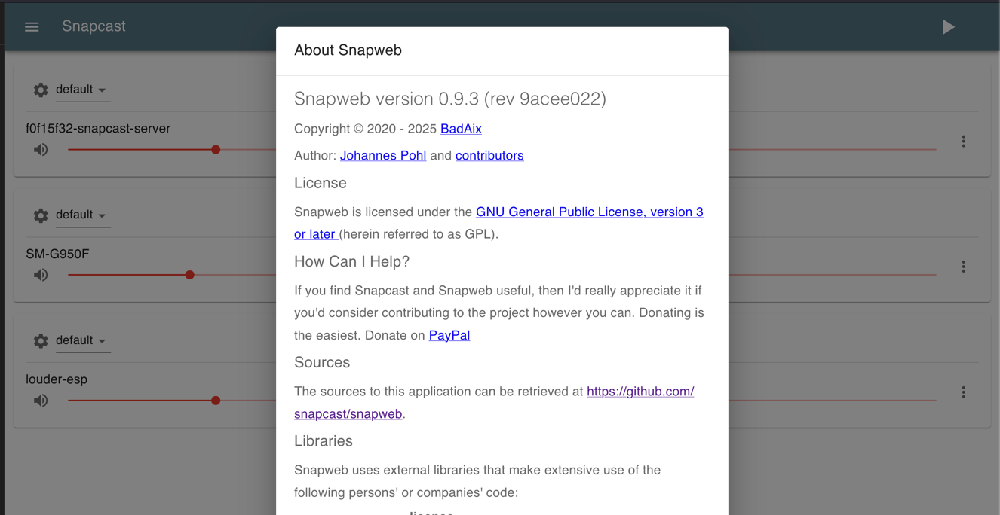
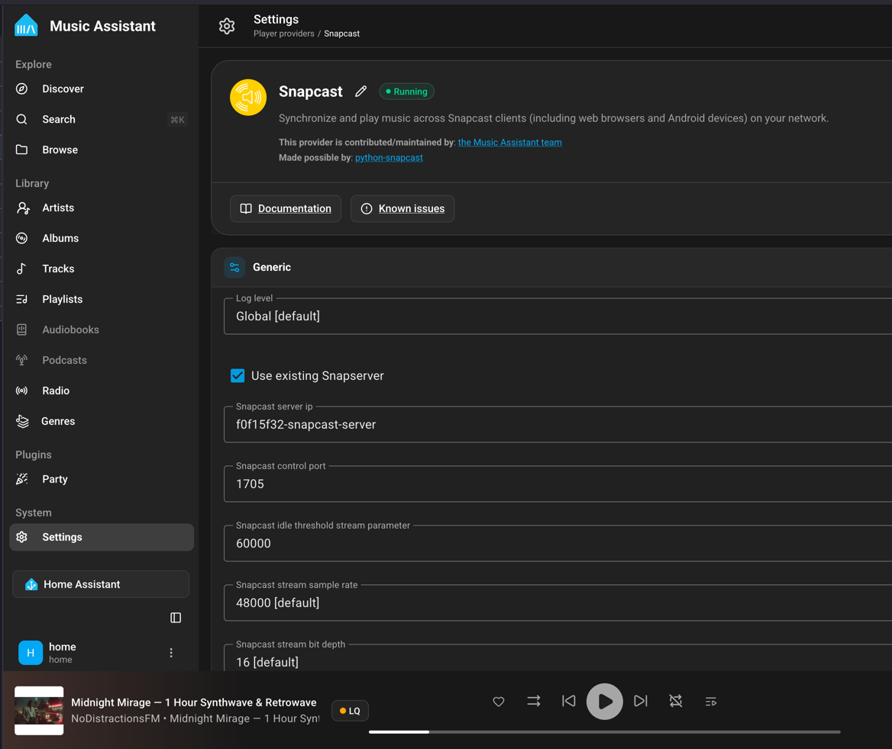

# Stashchenko's Home Assistant Apps Repository

Welcome to **Stashchenko's Home Assistant Apps Repository**. This repository provides custom, high-performance add-ons for Home Assistant, focused on multi-room synchronized audio, custom audio piping, and smart media streaming.

---

## 🚀 Quick Installation

### Method 1: Automatic (Recommended)

Click the **Add Repository** button below to automatically add this repository to your Home Assistant instance:

---

### Method 2: Manual

1. In Home Assistant, go to **Settings** -> **Add-ons** -> **Add-on Store**.
2. Click the **three dots (⋮)** in the top right corner and select **Repositories**.
3. Paste the following URL into the repository field: `https://github.com/stashchenko/hassio-addons`
4. Click **Add**, close the dialog, and refresh the store page.

---

## 📦 Available Add-ons

| Add-on | Description | Supported Architectures |
| :--- | :--- | :--- |
| **[Snapcast Server](https://github.com/Stashchenko/hassio-addons/tree/main/snapcast-server)** | Synchronized multi-room audio server with built-in **Spotify Connect (Librespot)** and **Snapweb UI**. | ![aarch64][aarch64-shield] ![amd64][amd64-shield] |

---

## 🎵 Add-on Highlights

### [Snapcast Server with Spotify Connect Support](https://github.com/Stashchenko/hassio-addons/tree/main/snapcast-server)

A feature-packed Snapserver setup designed for seamless Home Assistant and Music Assistant integration.

* **Spotify Connect Built-in:** Includes `librespot` out-of-the-box so your Snapcast server acts as a direct Spotify player.
* **Integrated Web Dashboard:** Includes the built-in [Snapweb](https://github.com/badaix/snapweb) web client directly accessible from your browser or Home Assistant Ingress/Sidebar.

* **Music Assistant Ready:** Fully compatible with Music Assistant dynamic audio streams (including default TCP stream auto-discovery).

* **mDNS / Avahi Auto-Discovery:** Instant client discovery across your local network (ESP32 `libsnapcast`, Android, Linux, Snapclient).

---

## 🐛 Issues & Support

If you encounter any bugs, have feature requests, or run into configuration issues:

* Open an issue in the **[GitHub Issue Tracker](https://github.com/stashchenko/hassio-addons/issues)**.
* Include relevant add-on logs from **Settings -> Add-ons -> [Add-on Name] -> Logs**.

---

## 📄 License

This repository is licensed under the Apache License 2.0.

[aarch64-shield]: https://img.shields.io/badge/aarch64-yes-brightgreen.svg?style=flat-square
[amd64-shield]: https://img.shields.io/badge/amd64-yes-brightgreen.svg?style=flat-square
